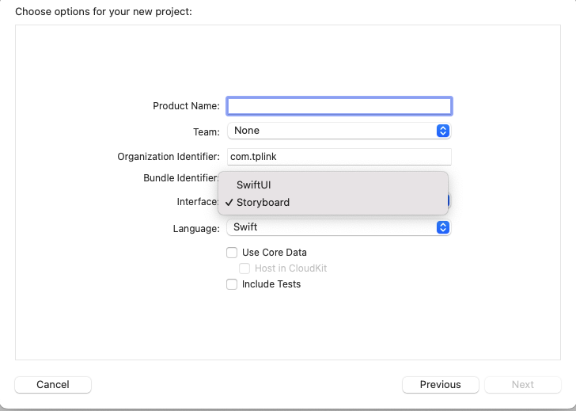
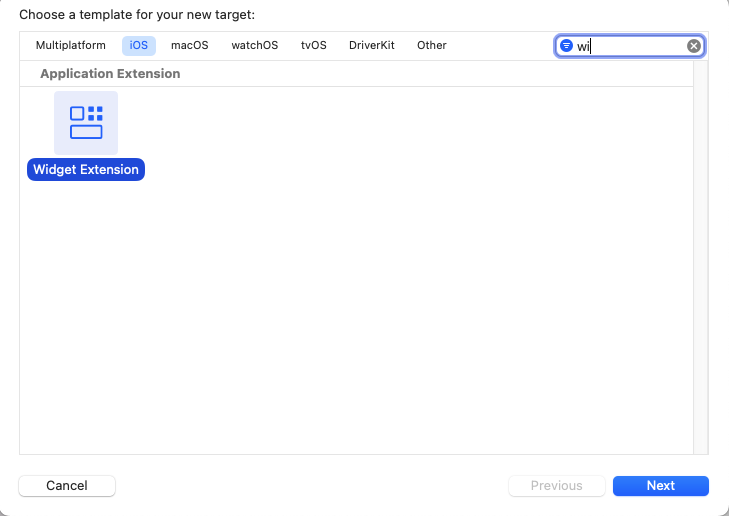
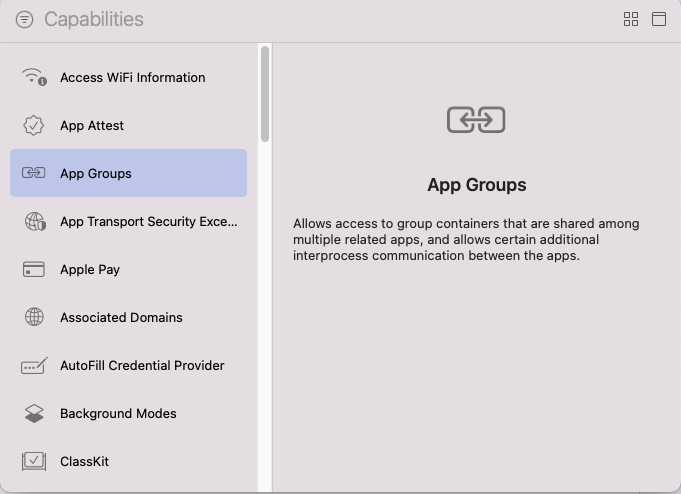
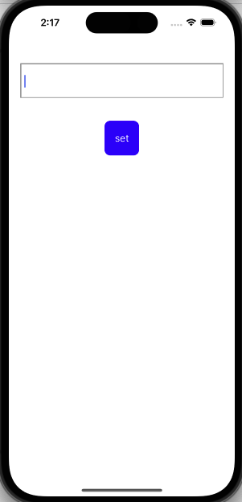
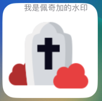
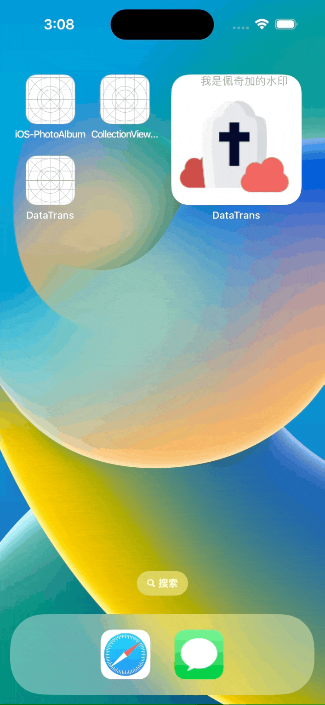

# 如何优雅的操作widget

[TOC]

## 一、WidgetKit介绍

---

WidgetKit通过将小部件放在iOS主屏幕和macOS通知中心上，让用户可以随时访问应用程序中的内容。本片博客将以图片的格式展示小组件与源程序之间的数据通信。

## 二、实践步骤

---

### 1.创建项目

首先是随便创建一个项目，这里需要注意的是，无论你创建的是Storyboard的项目，还是SwiftUI的项目，当需要创建iOS小组件，也就是Widget时候，都会创建一个SwiftUI的项目，所以这里可以随便选择，在这里，我们选择使用Storyboard来创建一个项目。


然后我们点击项目，创建一个Target，搜索一下Widget，点击创建，这样子我们就基于提供的widget模版，创建了一个widget了，有关于widget怎么刷新，可以查看初始化之后的timelines的官方文件。


因为需要同步App这边和小组件那边的数据，所以我们还需要创建一个AppGroup用来同步两边的数据。


创建完我们需要的东西就可以开始写功能了！

### 2.初始化布局

在主程序中，我们需要有一个输入框以及一个可以点击的按钮进行设置操作，在小组件中的布局就更简单了，我们只需要一张图片，在此为了可以优雅的说明小组件使用swiftUI布局的问题，所以特地给图片加上水印，下图是二者的布局预览效果。




布局代码：

```swift
// app页面布局
func setupView() {
    inputText = UITextField(frame: CGRect(x: 0, y: 100, width: self.view.bounds.width - 40, height: 60))
    setButton = UIButton(frame: CGRect(x: 0, y: 200, width: 60, height: 60))

    guard let setButton = setButton else { return }
    guard let inputText = inputText else { return }

    setButton.setTitle("set", for: .normal)
    setButton.backgroundColor = .blue
    setButton.center.x = view.center.x
    setButton.layer.cornerRadius = 10

    inputText.center.x = view.center.x
    inputText.borderStyle = .bezel

    view.addSubview(inputText)
    view.addSubview(setButton)
}


```

```swift

// 小组件页面布局
struct DataShowEntryView : View {
    var entry: Provider.Entry

    var body: some View {
        ZStack(alignment: .topTrailing) {
            Image("\(entry.text)")
                .resizable()
                .scaledToFit()
            Text("我是佩奇加的水印")
                .foregroundColor(.gray)
                .padding(.horizontal)
                .font(.footnote)
        }
    }
}

```

### 3.设置功能

在app程序内，我们只需要设置点击响应事件的功能，具体功能为，点击之后获取文本框输入的信息，用输入的文字来找到对应的图片信息，同时更新一下小组件那边的数据即可，设置按钮相应的具体函数为：

```swift

@objc func buttonClick() {
    guard let inputText = inputText else { return }
    let userDefaults = UserDefaults(suiteName: "group.learn.lihuiqi")
    userDefaults?.set(inputText.text, forKey: "text")

    inputText.text = nil
    WidgetCenter.shared.reloadAllTimelines()
}

```

小组件那边对应的具体更新数据在也在timelines中，我们只需修改数据即可，具体的更新点首先是存放数据的结构体，我们需要添加刚刚获取的文字信息；其次是timelines中对数据进行获取，在模版中是有类似的data，我们只需要对数据源进行更换即可，具体代码如下：

```swift
// 数据源存放的结构体
struct SimpleEntry: TimelineEntry {
    let date: Date
    let text: String
}

// timelines中更换数据源
func getTimeline(in context: Context, completion: @escaping (Timeline<Entry>) -> ()) {

    let userDefaults = UserDefaults(suiteName: "group.learn.lihuiqi")
    let textShow = userDefaults?.value(forKey: "text") as? String ?? "rip"
    var entries: [SimpleEntry] = []

    // Generate a timeline consisting of five entries an hour apart, starting from the current date.
    let currentDate = Date()
    for hourOffset in 0 ..< 5 {
        let entryDate = Calendar.current.date(byAdding: .hour, value: hourOffset, to: currentDate)!
        let entry = SimpleEntry(date: entryDate, text: textShow)
        entries.append(entry)
    }

    let timeline = Timeline(entries: entries, policy: .atEnd)
    completion(timeline)
}
```

到这里所有的功能就都设置完了，当然，接触过SwiftUI的同事，应该都很清楚在自动生成这些模版时候都会自带一个preview，让我们实时查看layout的更新，这里也用到了数据源，所以程序需要运行起来的话，就需要去解决这里的报错信息，优雅的选择是我们去把preview中的数据源也一块改了；或许也可以选择更暴力一点的？直接删除这一段代码，看不见自然也就不会报错啦。

## 三、最终效果展示

---

我储存了三张图片，只要输入三张图片的名字点击set按钮就可以进行设置图片，并且图片上面有刚刚设置的水印，具体效果如下


## 四、附件

---

本项目的源文件，欢迎大家批评指正！

[项目源码](https://github.com/HQ-L/iOS-Widget)
